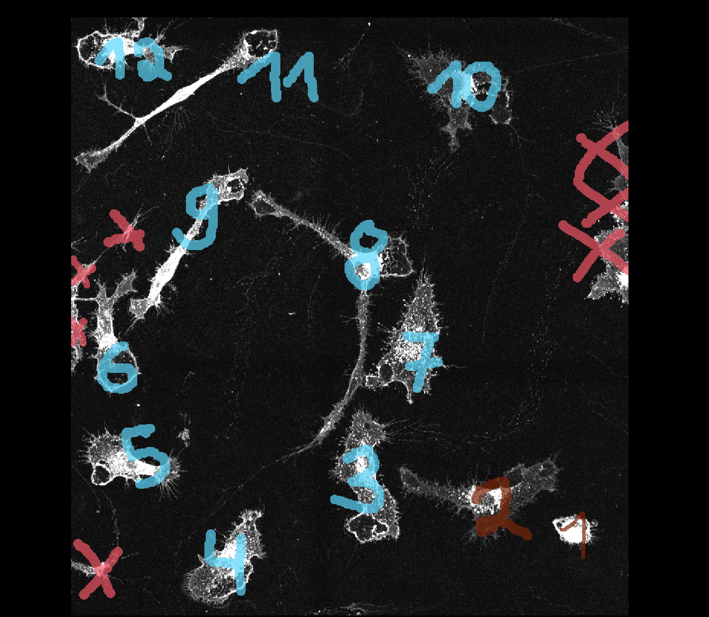
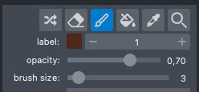
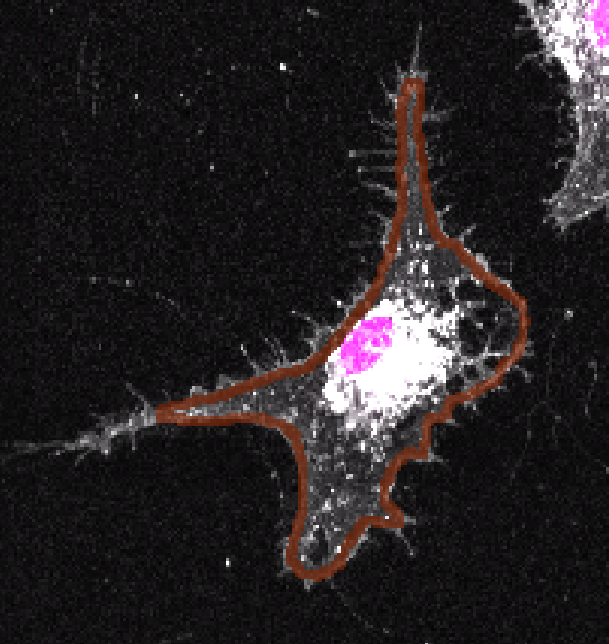
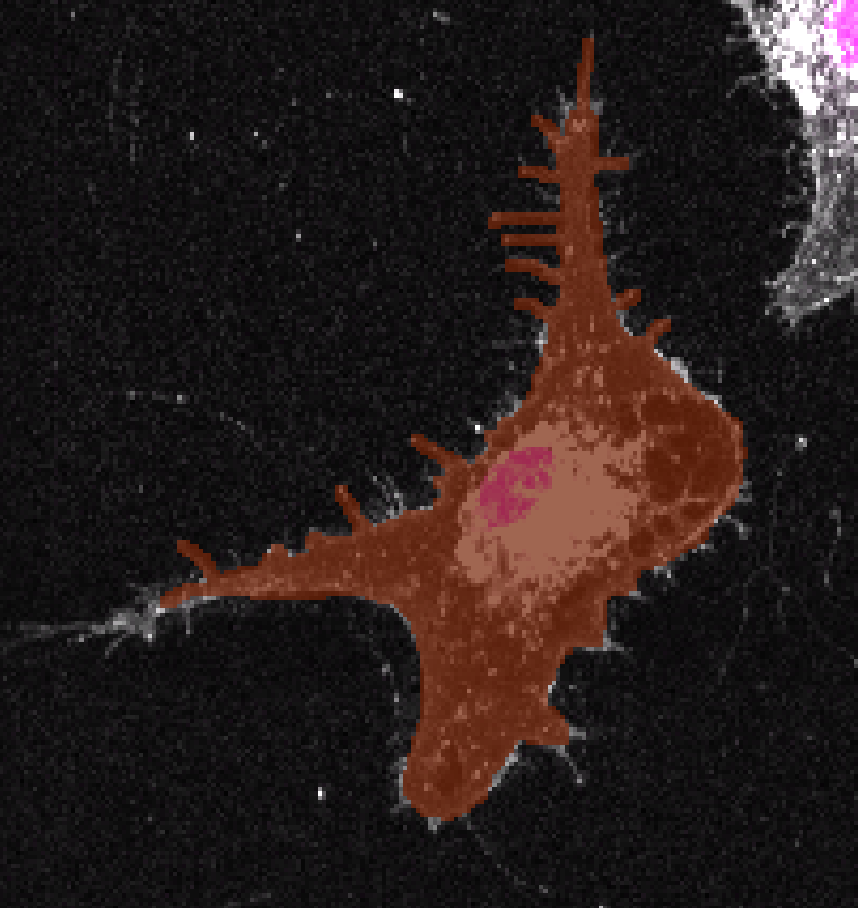
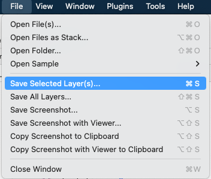
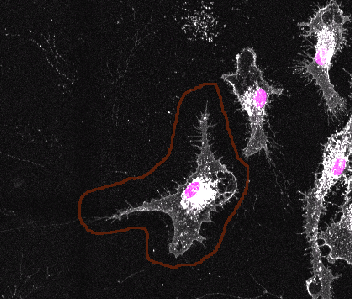
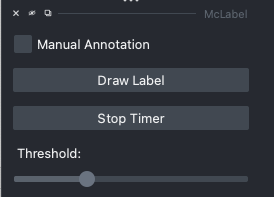

# McLabel User Study

## Welche Makrophagen werden gelabelt?

Idealerweise in der gezeigten Reihenfolge, ist aber kein muss. 

## Genereller Ablauf

Benötigt werden zwei Durchläufe - zunächst ohne McLabel, dann mit McLabel. Die benötigte Zeit zum Labeln soll verglichen werden. Idealerweise wird zwischen den beiden Durchläufen eine Pause von mehreren Stunden gemacht (die braucht man wahrscheinlich eh). 

## Manuelle Annotation

1. Napari öffnen

2. McLabel via Plug-In Menü starten

3. Mitgeliefertes Bild in Napari öffnen (z.B. via drag&drop)

4. Button `Convert Images` drücken

5. Haken `Manual Annotation`  setzen

6. Zur ersten Makrophage die gelabelt werden soll hinzoomen

7. In den `Paint`-Mode gehen durch anwählen des Buttons (siehe Bild) oder mit Key-Bind  `2` auf der Tastatur. Die brush-size kann beliebig gewählt werden.
   

8.  Wenn bereit zum labeln, Button `Start Timer` drücken!

9. Nun kann die Makrophage gelabelt werden. Am schnellsten geht es meistens wenn man grob die Umrisse im inneren der Makrophage aufzeichnet (siehe Bild):
   

10. Der Umriss kann mit dem Fill-Bucket (Key-Binding: `3`) direkt ausgefüllt werden: Das geht schneller als alles von Hand auszumalen. 

    

11. Die feinen Strukturen sowie der Rand müssen dann leider trotzdem noch von Hand ausgemalt werden.  Die abgebildete Makrophage ist nicht vollständig gelabelt! 

12. Wenn man mit dem Ergebnis zufrieden ist `Stop Timer` drücken. 

13. Weiter zur nächsten Makrophage. Das aktuelle Label muss um 1 erhöht werden (Key-Bind `=`  oder plus-button in der gui drücken)

14. GANZ WICHTIG: Vor dem Start mit dem Labeln der nächsten Makrophage wieder den Timer starten

Wenn fertig:
Layer `OutputLabel` als tiff speichern:

## Annotation mit McLabel

1. Napari starten

2. McLabel starten 

3. Button `Convert Images` drücken

4. Den Button `Start Timer` drücken sobald man sich bereit fühlt. 

5. Nun direkt den groben Umriss der Makrophage aufzeichnen:
    

6. Dann den Button `Compute Label` drücken. Wenn das Ergebnis passt kann der Timer direkt gestoppt werden und mit der nächsten Makrophage weiter gemacht werden.
   Falls das Ergebnis nicht gefällt, kann mit dem Threshold slider:
   
   das Ergebnis weiter verfeinert werden. Manchmal muss noch mit der Brush, analog zum manuellen Modus, nachgearbeitet werden. Wenn das Ergebnis gefällt, Timer stoppen. 

7. Nächste Makrophage raussuchen, Timer starten, `Draw Label` drücken und dann wieder den Umriss zeichnen. 

   

   ## Ergebnisse

   Die Results werden im home directory in einem Ordner mclabel gespeichert. Diesen bitte zippen und mir zusenden. Vielen Dank :blush: